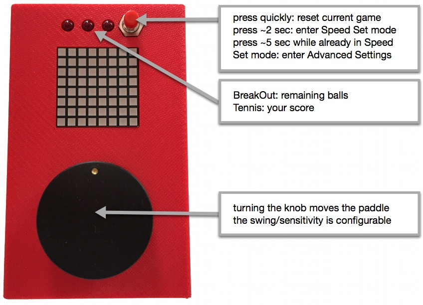
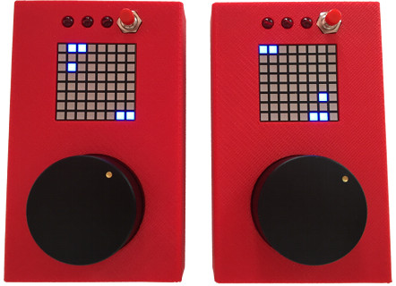
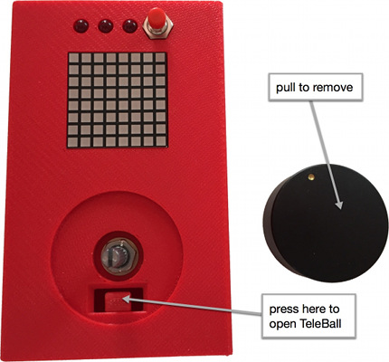

Playing TeleBall
================

Basics
------

 
When you start your TeleBall, you're ready to play BreakOut. The factory
default settings feature a rather slow ball speed and a big paddle swing,
i.e. you need to rotate the knob heavily to move the paddle.

BreakOut
--------

 
BreakOut is an Arcade classic. Watch TeleBall in action on
[YouTube](http://youtu.be/JpwP330C6q0)
to see how it works.

* Clear all bricks to advance to the next level. There are three levels
  available. Enjoy the applause when you mastered all three levels.

* You can twist/spin the ball by very quickly moving the paddle just in
  the right moment in time, when the ball hits your paddle. This enables
  you to "move" the ball to regions that it would not hit otherwise.

* The challenge heavily depends on the ball's speed, so be sure to
  use Speed Set mode to configure the game to fit your needs.

BreakOut is TeleBall's default mode, so it not only starts in BreakOut
mode, but it also reverts back to BreakOut if something goes wrong
while playing Tennis for Two.

Tennis for Two
--------------

 
As the name is suggesting, Tennis for Two is a multiplayer game, i.e.
you need two TeleBall devices to play it. TeleBall is using radio on
the 2.4 GHz frequency to communicate between the devices. Watch it
in action on [YouTube](http://youtu.be/hnW40l3Gluc).

* From your perspective (on your device), you are playing the lower
  paddle and your opponent the upper one. For your opponent's perspective
  the game looks just the other way round.

* Win three rounds to win the match. Press the reset button afterwards
  to start a new match.

* The twist/spin move known from BreakOut is also very useful in Tennis.

* Any player can reset the match any time using the reset button.

### Starting a Match

The first two minutes after being switched on, TeleBall is searching
for another player. After two minutes, the scanner is turned off, i.e.
you might want to restart your devices if you played BreakOut before
and want to start a Tennis for Two match.

To start a match, bring two devices into a very close physical proximity
and perform the following steps:

1. Switch on both TeleBalls.

2. After a few seconds, both TeleBalls are displaying a question mark (?).

3. Both players now need to turn the knob to the right side until
   the question mark turns into an exclamation mark (!).

4. Both players need to confirm playing tennis by pressing the red button.

5. The Tennis for Two match starts.

Tennis for Two can only be left by switching at least one of the TeleBalls
off.

During step (4): If one player confirms and the other does not yet, 
then the exclamation mark on his screen starts to shrink to indicate
the ~8 second timeout. After that period, TeleBall assumes
that the other player does not want to join and reverts back to BreakOut.

Instead of confirming playing Tennis for Two using the exclamation mark,
the players can also turn their knob to the left side - the question mark
is shown - and go back to BreakOut.

### Adjusting the Challenge

Adjusting the challenge means adjusting the speed of the game.
Any player can enter the Speed Set mode to adjust the game's speed
for both players. The game is paused while in Speed Set mode, both
devices are showing a synchronized Speed Set screen, but only the
player who entered the Speed Set mode is able to adjust
the speed - the other player is watching.

### Known Issues

* The radio range is currently very low: You literally need to be
  very close to your opponent - in the range of two to three meters -
  to be able to play Tennis for Two.

* The quality of the radio connection is influenced by active WLAN connections.

* If radio packets drop, e.g. because the two players are pretty far away from
  each other, graphic errors and stuttering playing behaviour might occur - but
  the game can be continued.

* If more radio packets drop, e.g. because the distance between the players 
  is too large, the game might revert back to BreakOut.

* You must not turn on more than two TeleBall devices that are in radio
  range simultaneously. The behaviour is undefined is this case.

Speed Set Mode
--------------

* Press the red button for about two seconds and then release it.

* You are now in Speed Set mode.

* Turn the knob to the left side to decrease the speed for BreakOut
  as well as for Tennis for Two and turn it to the right to increase it.

* While in Speed Set mode, the speed is visualized by the amount of
  blue squares: The more blue squares, the higher the speed.

* Press the red button and release it quickly to leave Speed Set mode.

Hint: TeleBall will "forget" this speed the next time you turn it off
and on again and instead use the default speed. To remember this speed
and to make it the new default speed, you need to store it to TeleBall's
EEPROM using the Advanced Settings.

Advanced Settings
-----------------

Enter the Advanced Settings by pressing the red button for about
five seconds while already being in Speed Set mode. It is advisable to
set the desired speed in Speed Set mode *before* entering the Advanced
Settings - otherwise you might save a speed in the EEPROM that does not
suit your needs.

While being in Advanced Settings, you cycle through the following
configuration options by pressing the red button and releasing it quickly:

* Brightness: Knob left/right = decrease/increase.

* Leftmost Paddle: Precisely turn the knob to the position that you
  want to be the paddle's leftmost position.

* Rightmost Paddle: Precisely turn the knob to the position that you
  want to be the paddle's rightmost position. If you are not moving
  the knob between leftmost and rightmost, then the old setting
  remains, i.e. no change is happening. The combination of the
  leftmost and rightmost position is setting the paddle's sensitivity.

* Store or Factory Default: You are now either seing a smaller square
  within a larger square or something that resembles an X, depending
  if you rotate the knob to the right (square) or to the left (X).

  Square = save settings / remember them in future.
  
  X = back to Factory Default values.

Changing Batteries
------------------

 
TeleBall runs on four AA batteries. When opening the case, be careful
not to damage the speaker, which needs to be placed back exactly into
its defined position before closing the case again.