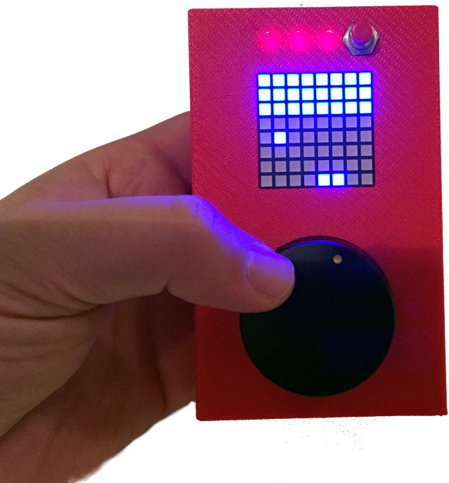
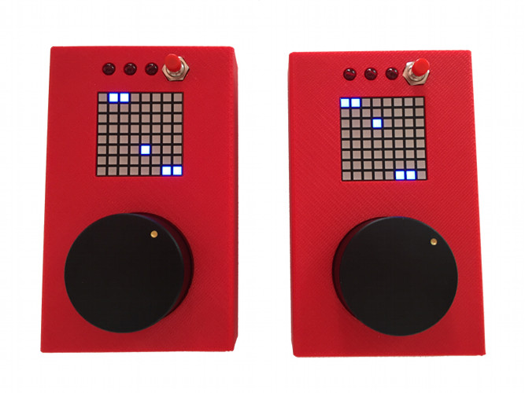

TeleBall - Retro Handheld Game Console
======================================

What is TeleBall?
-----------------

TeleBall is a handheld game console. You cannot buy it. You need to build it
by yourself. It lets you play **BreakOut** in single-player mode using one
device and **Tennis for Two** in multi-player mode using two devices
communicating via radio.


<iframe width="640" height="360" src="http://www.youtube.com/embed/JpwP330C6q0" frameborder="0" allowfullscreen></iframe>




TeleBall is pretty retro and very minimalistic: It features an
8x8 pixel LED matrix display, a paddle as game controller and one button.
Therefore, the range of possible games is limited but you will be surprised
how much fun and even zenlike meditation this kind of gameplay can bring you,
particularly when you play Tennis for Two with a friend.


<iframe width="640" height="360" src="http://www.youtube.com/embed/hnW40l3Gluc" frameborder="0" allowfullscreen></iframe>




The videos shown here are both using the beginner-friendly slower game modes.
When playing Tennis for Two, you might want to switch TeleBall to much
faster modes. The [Play](doc/play.html) section of this documentation is telling you how.

TeleBall runs on 4 AA batteries. It features a Mini USB port for software updates,
that means, you can either run and update the build-in games on TeleBall or you can
create your own games using the [Arduino platform](http://www.arduino.cc). The source
code provided with the standard package is heavily documented, so it is a perfect
starting point for learning how to develop for TeleBall.

How to Build Your Own TeleBall
------------------------------

Building your own TeleBall device is a multi-discipline DIY project that can be
done during one weekend, given that you have all the hardware parts available
and some basic soldering equipment and skills. Depending on your choices when
it comes to 3D printing, the PCB and the actual electronics parts, one device
will cost you something between $100 and $150.

The [TeleBall GitHub Repository](https://github.com/sy2002/TeleBall) contains
all necessary files, schematics and source code. It also contains this documentation
as an offline version, so just open `index.html` in the package's root folder
to have it always handy.

In a nutshell, these are the five steps to build your own TeleBall:

1. [Download](https://github.com/sy2002/TeleBall/zipball/master)
   the TeleBall package from GitHub or
   [Fork it on GitHub](https://github.com/sy2002/TeleBall/fork).
   
2. 3D print the case with your own 3D printer or using an online 3D printing service.
   Have a look at the [Case](doc/case.html) section to learn more.

3. Order a printed circuit board (PCB, there are plenty of online services that
   are offering this) and order all other hardware parts. Admittedly, this is the
   most cumbersome - and possibly lengthy - part of project, as you will need
   to query more than one vendor to find all parts. The [Electronics](doc/electronics.html)
   section shares all the details, including a bill of material.

4. Solder and wire everything. The case and PCB design guarantee, that no additional
   screws or fittings are needed: Everything fits together thanks to the custom
   3D printed case and soldering the 8x8 LED display on the PCB will hold
   the PCB and the case together.

5. Flash the TeleBall firmware as described in [Software](doc/software.html).

Authors
-------

### The Makers

* [sy2002](http://www.sy2002.de): idea, software/code and original circurit design
* doubleflash: additional circurit design and board layout
* lamags: body housing/case

TeleBall was designed, built and released as an Open Source / Open Hardware project
during August 2014 and January 2015.

TeleBall is a project of the [Museum of Electronic Games & Art](http://www.m-e-g-a.org).

### Stay in Touch

If you have any questions or comments, we are happy to hear from you. Email us at

* sy2002 at teleball.org
* doubleflash at teleball.org
* lamags at teleball.org

### Acknowledgements

* TeleBall is built on the [Arduino platform](http://www.arduino.cc), i.e. the
  microcontroller core as well as the software are Arduino based.
* The case is designed using [FreeCad](http://www.freecadweb.org).
* The PCB is designed using the free version of [Eagle](http://www.cadsoftusa.com/).
* The firmware uses [wayoda / LedControl](https://github.com/wayoda/LedControl) as a
  MAX7221 driver and [TMRh20 / RF24](http://tmrh20.github.io/RF24/) as a nRF24L01+ driver.
* The great [DuinoKit](http://www.duinokit.com) was sy2002's original inspiration to
  create the [BreakOut Tutorial](http://duinokit.com/ShowAndTell/viewtopic.php?f=4&t=14),
  which itself turned into the origin of TeleBall.
* The project's web page theme is based on [broccolini / dinky](https://github.com/broccolini/dinky).